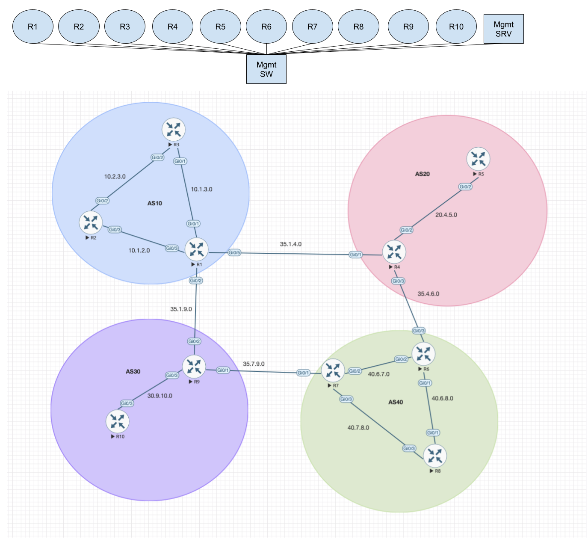

# BGP Basic Lab

A comprehensive BGP (Border Gateway Protocol) lab environment featuring multiple autonomous systems with iBGP and eBGP peering relationships, built using Cisco IOS routers and managed with Ansible automation.

## Lab Topology



### Autonomous Systems

- **AS 10**: R1, R2, R3 (iBGP full mesh)
- **AS 20**: R4, R5 (iBGP peering)
- **AS 30**: R9, R10 (iBGP peering)
- **AS 40**: R6, R7, R8 (iBGP full mesh)

### Router Details

| Router | Loopback IP | AS | Role | Management IP |
|--------|-------------|----|----|---------------|
| R1 | 1.1.1.1/32 | 10 | Edge Router | 192.168.2.11 |
| R2 | 2.2.2.2/32 | 10 | Internal Router | 192.168.2.12 |
| R3 | 3.3.3.3/32 | 10 | Internal Router | 192.168.2.13 |
| R4 | 4.4.4.4/32 | 20 | Edge Router | 192.168.2.14 |
| R5 | 5.5.5.5/32 | 20 | Internal Router | 192.168.2.15 |
| R6 | 6.6.6.6/32 | 40 | Edge Router | 192.168.2.16 |
| R7 | 7.7.7.7/32 | 40 | Edge Router | 192.168.2.17 |
| R8 | 8.8.8.8/32 | 40 | Internal Router | 192.168.2.18 |
| R9 | 9.9.9.9/32 | 30 | Edge Router | 192.168.2.19 |
| R10 | 10.10.10.10/32 | 30 | Internal Router | 192.168.2.20 |

## BGP Peering Relationships

### iBGP (Internal BGP)
- **AS 10**: R1 ↔ R2 ↔ R3 (full mesh)
- **AS 20**: R4 ↔ R5
- **AS 30**: R9 ↔ R10
- **AS 40**: R6 ↔ R7 ↔ R8 (full mesh)

### eBGP (External BGP)
- AS 10 (R1) ↔ AS 20 (R4): 35.1.4.0/24
- AS 10 (R1) ↔ AS 30 (R9): 35.1.9.0/24
- AS 20 (R4) ↔ AS 40 (R6): 35.4.6.0/24
- AS 30 (R9) ↔ AS 40 (R7): 35.7.9.0/24

## Network Infrastructure

### Interior Gateway Protocol (IGP)
- **Protocol**: OSPF Area 0
- **Purpose**: Provides reachability for BGP loopback addresses within each AS
- **Router IDs**: Match loopback IP addresses (1.1.1.1, 2.2.2.2, etc.)

### Key Network Segments

#### AS 10 Internal Links
- R1-R2: 10.1.2.0/24
- R1-R3: 10.1.3.0/24
- R2-R3: 10.2.3.0/24

#### AS 20 Internal Links
- R4-R5: 20.4.5.0/24

#### AS 30 Internal Links
- R9-R10: 30.9.10.0/24

#### AS 40 Internal Links
- R6-R7: 40.6.7.0/24
- R6-R8: 40.6.8.0/24
- R7-R8: 40.7.8.0/24

#### Inter-AS Links (eBGP)
- AS10-AS20: 35.1.4.0/24 (R1-R4)
- AS10-AS30: 35.1.9.0/24 (R1-R9)
- AS20-AS40: 35.4.6.0/24 (R4-R6)
- AS30-AS40: 35.7.9.0/24 (R9-R7)

## Management Network

- **Network**: 192.168.2.0/24
- **Gateway**: 192.168.2.1
- **Management VRF**: Configured on all routers for out-of-band management
- **Access**: SSH v2 enabled with local authentication

## BGP Configuration Highlights

### Route Advertisement
- Each router advertises its loopback network
- iBGP peers use `update-source Loopback0`
- Edge routers use `next-hop-self` for iBGP neighbors

### Key BGP Features Demonstrated
- iBGP full mesh within AS 10 and AS 40
- iBGP simple peering in AS 20 and AS 30
- eBGP peering between autonomous systems
- Route reflection concepts (can be extended)
- BGP path selection and routing policies

## Prerequisites

### Software Requirements
- Ansible (with cisco.ios collection)
- Python 3.x
- Ansible Vault for credential management

### Hardware/Virtualization
- Cisco IOS routers (virtual)
- EVE-NG
- Sufficient compute resources for 10 router instances

### Network Access
- Management network connectivity to 192.168.2.0/24
- SSH access to all router management interfaces


### Run Configuration Backup
```bash
cd ansible
ansible-playbook -i inventory.yml simple_backup.yml -v --vault-password-file ~/.ansible_vault_pass
```


### Useful Debug Commands
```bash
debug ip bgp events
debug ip bgp updates
debug ip ospf adj
show ip bgp neighbors <ip> advertised-routes
show ip bgp neighbors <ip> received-routes
```

## File Structure

```
BGP-Basic/
├── README.md                          # This documentation
├── ansible/
│   ├── ansible.cfg                    # Ansible configuration
│   ├── inventory.yml                  # Device inventory
│   ├── simple_backup.yml             # Configuration backup playbook
│   └── device-configs/               # Router configuration backups
│       ├── R1-config
│       ├── R2-config
│       ├── ...
│       └── R10-config
```
