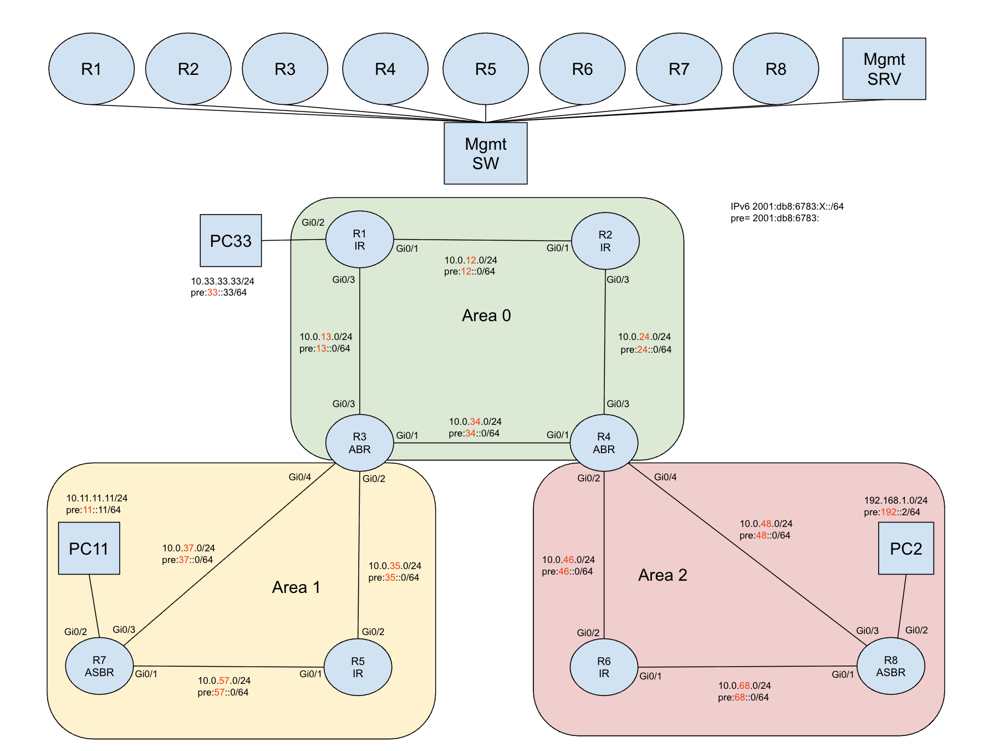
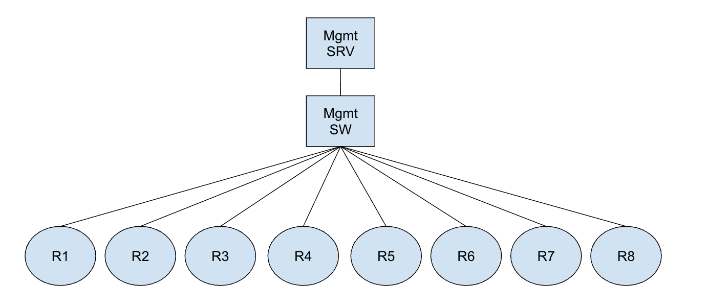

# OSPFv3 IPv4/IPv6 Lab Documentation

## Lab Overview

This advanced OSPFv3 lab demonstrates dual-stack IPv4 and IPv6 routing using OSPFv3 on Cisco IOS routers. The lab is designed for CCNP ENCOR-level understanding and includes multi-area OSPF configuration with both address families.

## Network Topology

The lab consists of 8 routers (R1-R8) interconnected in a multi-area OSPFv3 topology:

## Lab Topology


## Management Topology


### OSPF Areas
- **Area 0 (Backbone)**: R1, R2, R3, R4
- **Area 1**: R3, R5, R7
- **Area 2**: R4, R6, R8

### Router Roles
- **R1**: Area 0 router with passive interface (simulated LAN)
- **R2**: Area 0 router
- **R3**: Area Border Router (ABR) - connects Area 0 and Area 1
- **R4**: Area Border Router (ABR) - connects Area 0 and Area 2
- **R5**: Area 1 internal router
- **R6**: Area 2 internal router
- **R7**: Area 1 router with passive interface (simulated LAN)
- **R8**: Area 2 router with additional LAN segment

## IP Addressing Scheme

### IPv4 Addressing

#### Loopback Interfaces
| Router | IPv4 Address | Subnet Mask |
|--------|--------------|-------------|
| R1 | 1.1.1.1 | /32 |
| R2 | 2.2.2.2 | /32 |
| R3 | 3.3.3.3 | /32 |
| R4 | 4.4.4.4 | /32 |
| R5 | 5.5.5.5 | /32 |
| R6 | 6.6.6.6 | /32 |
| R7 | 7.7.7.7 | /32 |
| R8 | 8.8.8.8 | /24 |

#### Point-to-Point Links
| Link | Network | R1 | R2 | R3 | R4 | R5 | R6 | R7 | R8 |
|------|---------|----|----|----|----|----|----|----|----|
| R1-R2 | 10.0.12.0/24 | .1 | .2 | - | - | - | - | - | - |
| R1-R3 | 10.0.13.0/24 | .1 | - | .3 | - | - | - | - | - |
| R2-R4 | 10.0.24.0/24 | - | .2 | - | .4 | - | - | - | - |
| R3-R4 | 10.0.34.0/24 | - | - | .3 | .4 | - | - | - | - |
| R3-R5 | 10.0.35.0/24 | - | - | .3 | - | .5 | - | - | - |
| R3-R7 | 10.0.37.0/24 | - | - | .3 | - | - | - | .7 | - |
| R4-R6 | 10.0.46.0/24 | - | - | - | .4 | - | .6 | - | - |
| R4-R8 | 10.0.48.0/24 | - | - | - | .4 | - | - | - | .8 |
| R5-R7 | 10.0.57.0/24 | - | - | - | - | .5 | - | .7 | - |
| R6-R8 | 10.0.68.0/24 | - | - | - | - | - | .6 | - | .8 |

#### LAN Segments
| Network | Router | Interface | Purpose |
|---------|--------|-----------|---------|
| 10.33.33.0/24 | R1 | Gi0/2 | Passive Interface (Area 0) |
| 10.11.11.0/24 | R7 | Gi0/2 | Passive Interface (Area 1) |
| 192.168.1.0/24 | R8 | Gi0/2 | LAN Segment (Area 2) |

### IPv6 Addressing

#### Loopback Interfaces
| Router | IPv6 Address |
|--------|--------------|
| R1 | 2001:DB8:6783:1111::1/64 |
| R2 | 2001:DB8:6783:2222::2/64 |
| R3 | 2001:DB8:6783:3333::3/64 |
| R4 | 2001:DB8:6783:4444::4/64 |
| R5 | 2001:DB8:6783:5555::5/64 |
| R6 | 2001:DB8:6783:6666::6/64 |
| R7 | 2001:DB8:6783:7777::7/64 |
| R8 | 2001:DB8:6783:8888::8/64 |

#### Point-to-Point Links IPv6
| Link | IPv6 Network | Host IDs |
|------|--------------|----------|
| R1-R2 | 2001:DB8:6783:12::/64 | ::1, ::2 |
| R1-R3 | 2001:DB8:6783:13::/64 | ::1, ::3 |
| R2-R4 | 2001:DB8:6783:42::/64 | ::2, ::4 |
| R3-R4 | 2001:DB8:6783:34::/64 | ::3, ::4 |
| R3-R5 | 2001:DB8:6783:35::/64 | ::3, ::5 |
| R3-R7 | 2001:DB8:6783:37::/64 | ::3, ::7 |
| R4-R6 | 2001:DB8:6783:46::/64 | ::4, ::6 |
| R4-R8 | 2001:DB8:6783:48::/64 | ::4, ::8 |
| R5-R7 | 2001:DB8:6783:57::/64 | ::5, ::7 |
| R6-R8 | 2001:DB8:6783:68::/64 | ::6, ::8 |

#### IPv6 LAN Segments
| Network | Router | Interface | Purpose |
|---------|--------|-----------|---------|
| 2001:DB8:6783:33::/64 | R1 | Gi0/2 | Passive Interface (Area 0) |
| 2001:DB8:6783:11::/64 | R7 | Gi0/2 | Passive Interface (Area 1) |
| 2001:DB8:6783:192::/64 | R8 | Gi0/2 | LAN Segment (Area 2) |

## OSPFv3 Configuration

### Global OSPF Settings
- **Process ID**: 1
- **Reference Bandwidth**: 1000 Mbps
- **Router IDs**: Based on loopback addresses (1.1.1.1, 2.2.2.2, etc.)

### Area Assignments
```
Area 0 (Backbone):
- R1: Gi0/1 (to R2), Gi0/2 (passive), Gi0/3 (to R3)
- R2: Gi0/1 (to R1), Gi0/3 (to R4)
- R3: Gi0/1 (to R4), Gi0/3 (to R1)
- R4: Gi0/1 (to R3), Gi0/3 (to R2)

Area 1:
- R3: Gi0/2 (to R5), Gi0/4 (to R7)
- R5: Gi0/1 (to R7), Gi0/2 (to R3)
- R7: Gi0/1 (to R5), Gi0/2 (passive), Gi0/3 (to R3)

Area 2:
- R4: Gi0/2 (to R6), Gi0/4 (to R8)
- R6: Gi0/1 (to R8), Gi0/2 (to R4)
- R8: Gi0/1 (to R6), Gi0/2 (LAN), Gi0/3 (to R4)
```

### Interface Configuration
Each OSPF-enabled interface is configured with:
```cisco
interface GigabitEthernet0/X
 ip address [IPv4_ADDRESS] [SUBNET_MASK]
 ipv6 address [IPv6_ADDRESS]/64
 ipv6 enable
 ospfv3 1 ipv4 area [AREA_NUMBER]
 ospfv3 1 ipv6 area [AREA_NUMBER]
```

### Passive Interfaces
- **R1 Gi0/2**: Both IPv4 and IPv6 passive (Area 0)
- **R7 Gi0/2**: IPv6 only passive (Area 1)

## Management Network

All routers are connected to a dedicated management network:
- **Network**: 192.168.2.0/24
- **VRF**: MGMT
- **Access**: SSH on port 22
- **Username**: admin
- **Default Route**: 192.168.2.1

### Management IP Assignments
| Router | Management IP |
|--------|---------------|
| R1 | 192.168.2.11 |
| R2 | 192.168.2.12 |
| R3 | 192.168.2.13 |
| R4 | 192.168.2.14 |
| R5 | 192.168.2.15 |
| R6 | 192.168.2.16 |
| R7 | 192.168.2.17 |
| R8 | 192.168.2.18 |

## Key OSPFv3 Features Demonstrated

### Dual Address Family Support
- IPv4 unicast address family
- IPv6 unicast address family
- Separate LSDBs for each address family
- Common OSPF process ID

### Multi-Area Design
- Backbone area (Area 0) with four routers
- Two non-backbone areas (Area 1 and Area 2)
- Area Border Routers (R3 and R4) connecting areas
- Proper area hierarchy maintenance

### Advanced Features
- Passive interfaces for LAN simulation
- Reference bandwidth optimization
- Dual-stack operation
- Management VRF separation

## Verification Commands

### OSPFv3 Status
```cisco
show ospfv3 neighbor
show ospfv3 database
show ospfv3 interface
show ospfv3 border-routers
```

### IPv4 OSPF Verification
```cisco
show ospfv3 ipv4 neighbor
show ospfv3 ipv4 database
show ospfv3 ipv4 route
show ip route ospf
```

### IPv6 OSPF Verification
```cisco
show ospfv3 ipv6 neighbor
show ospfv3 ipv6 database
show ospfv3 ipv6 route
show ipv6 route ospf
```

## Lab Learning Objectives

1. **OSPFv3 Fundamentals**: Understanding OSPFv3 operation for both IPv4 and IPv6
2. **Dual-Stack Implementation**: Configuring IPv4 and IPv6 simultaneously
3. **Multi-Area Design**: Implementing hierarchical OSPF design
4. **Area Border Routers**: Configuring and understanding ABR functionality
5. **Passive Interfaces**: Implementing network advertisement without neighbor formation
6. **Route Redistribution**: Understanding inter-area route advertisement
7. **Troubleshooting**: Using verification commands to validate OSPF operation

## Ansible Automation

The lab includes Ansible automation for:
- Configuration backup using `simple_backup.yml`
- Centralized device management via `inventory.yml`
- Vault-encrypted credentials for secure access
- Automated configuration deployment and verification

This lab provides a comprehensive hands-on experience with OSPFv3 in a dual-stack environment, essential for modern network engineering and CCNP ENCOR certification preparation.
